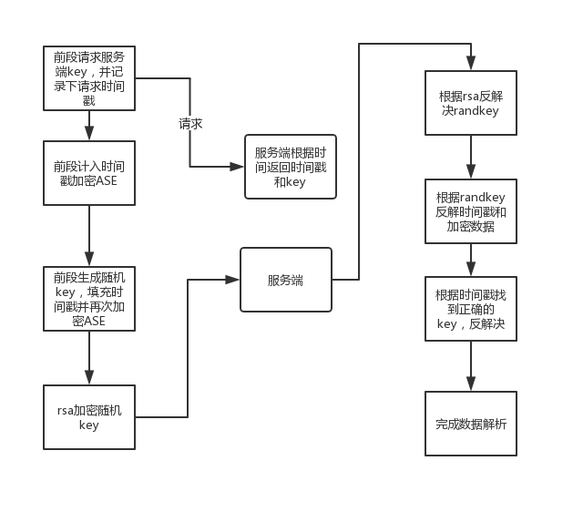

####分析：
#####可以使用网易云加密方式，对我们的参数进行加密：

    1 是ASE 的key 后段应该和前端相同，可以下发

    2 rsa的公钥和模数目是配对的，也可以进行下发

仿照网易云过程进行操作，可以提高一部分作弊门槛

另外如果想要提作弊门槛，需要前段进行操作：

    1 我们可以采用上面提到的，一次下发多个key，根据生成的randkey判断使
       用那个key 进行第一次加密，混淆作弊者，后台增加相应的操作即可
    2 将j加密函数进行伪装，加入混淆的逻辑，防止作弊者看懂

 整体逻辑就是：

     ASE（ASE（params,key）randkey） + rsa(randkey)

    可以在此基础上进行混淆
js,php代码
    
        rsa in javascript
        http://www.ohdave.com/rsa/
整体流程如下,如果我们要下发key,需要保证我们加密和解密是一个key可以用服务器时间戳来保证

基于以上就可以实现类似网易云的流程，可以看出网易云的流程对数据传输防窃取起到了很好的作用
但是对于我们的业务，我们可以在此基础上进行升级，另外rsa对于我们的业务并没有很大的促进作用，而且需要算力，我们可以不使用rsa加密，进行搞糟
    参考 https://github.com/FantasticLBP/Anti-WebSpider 
### 1网易云的接口请求到之后，是明文的数据，
 1 基于此，我们可以对服务端数据进行加密，客户端进行一层解析，然后再进行处理，可以混淆key和其他信息，可以拦截一批作弊者
 
    对于服务器传输数据，我们可以参考文章中的方式 
    1 指定一个加密规则，然后将关键的规则信息隐藏在 ttf字体文件中
    2 后端加密，前段解析出数据进行正常的业务活动
    3 如果想要更加难以分析，需要在这个基础上进行进一步拓展

