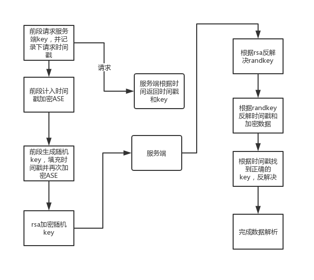

####分析：
#####可以使用网易云加密方式，对我们的参数进行加密：

    1 是ASE 的key 后段应该和前端相同，可以下发

    2 rsa加密可以看出，rsa的公钥和模数目是配对的，也可以进行下发

仿照网易云过程进行操作，可以提高一部分作弊门槛

另外如果想要提作弊门槛，需要前段进行操作：

    1 我们可以采用上面提到的，一次下发多个key，根据生成的randkey判断使
       用那个key 进行第一次加密，混淆作弊者，后台增加相应的操作即可
    2 将j加密函数进行伪装，加入混淆的逻辑，防止作弊者看懂

 整体逻辑就是：

     ASE（ASE（params,key）randkey） + rsa(randkey)

    可以在此基础上进行混淆
js,php代码
    
        rsa in javascript
        http://www.ohdave.com/rsa/
整体流程如下,如果我们要下发key,需要保证我们加密和解密是一个key可以用服务器时间戳来保证

