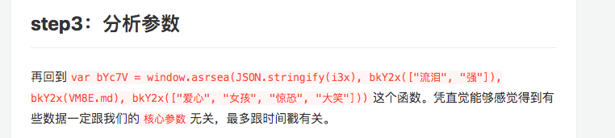

#网易云方案优点：
####针对安全：
    1 可以有效防止传输过程中被盗取传输信息
####针对作弊者常用的方式：
    1 隐藏了params的参数和信息，获取传参成本增加
    2 间隔修改下发的 key 获取key成本增加

###其他方面：
####如下图分析抓取数据信息起手处

#####作弊者看出第一个参数是和其他的不一样，并且直接开始打印参数，我们可以针对性得做些伪装
    1 如不使用json.stringify()函数 
    
    2 伪装一个 bkY2x函数，将我们的params参数传入函数，增加分析难度
    
    3 可以将参数进行进一步base64并加入伪装参数，然后传入上述参数，对于作弊者更进一步增加成本
    
    4 作弊者在分析数据的时候是看传参的数据是否发生改变，针对这个我们可以可以一次下发两个甚至多个key a1,a2,
    由随机数控制取选取使用那个key进行第一次加密，这样和3组合一起，可以增加分析难度

